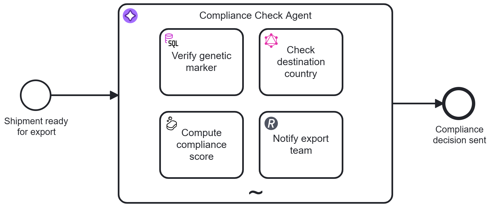

# Seed Export Compliance Agent

A small, self-contained Camunda 8 example illustrating the **Task agent** pattern
from [camunda.com/orchestrate/agents](https://camunda.com/orchestrate/agents/):

> Acts on systems. Queries databases, calls APIs, updates records, sends
> communications. The LLM reasons about which tool to invoke and when.



The process model lives at [models/seed-export-compliance-agent.bpmn](models/seed-export-compliance-agent.bpmn),
with a start form at [models/seed-export-shipment-ready.form](models/seed-export-shipment-ready.form).

## What this demonstrates

An AI Agentis given four tools, each hitting a **real, live, public, keyless** service. This showcases how those tools are governed by Camunda.

| # | What it does | Protocol | Public service used | Tool / BPMN element |
|---|---|---|---|---|
| 1 | Queries databases | SQL | UCSC public MySQL server (`hg38`) | `VerifyGeneticMarker` |
| 2 | Calls APIs | GraphQL | [Countries GraphQL API](https://countries.trevorblades.com/) | `CheckDestinationCountry` |
| 3 | Updates records | REST | [api.mathjs.org](https://api.mathjs.org) expression evaluator | `ComputeComplianceScore` |
| 4 | Sends communications | REST | [httpbin.io](https://httpbin.io) echo endpoint | `NotifyExportTeam` |

## Demo scenario

A shipment of seed stock is ready for export. Before it clears, an agent reads the shipment's free-text notes, works out the genetic marker and destination country referenced in them,
checks the destination country's basic profile (used to pick the right paperwork/ruleset), runs the marker and country through a legacy scoring engine, and notifies the export team with a clearance decision.

*(intentionally stretched to keep it simple)*

Here is sample input data:

* Shipment id: `SHIP-2026-0731`
* Shipment notes: `Shipment SHIP-2026-0731: seed stock ready for export to Brazil. Lab reference marker on the paperwork is TP53.`

The input is deliberately unstructured — the agent has to extract the gene marker symbol and convert the destination country to an ISO code itself, rather than receive them pre-parsed. That's the actual point of using an agent here: a fixed BPMN sequence of connector calls can't casually do that extraction and conversion step; an LLM can. The system prompt describes the goal and constraints, not a numbered call sequence — the agent decides which tools to call and when.

### Disclaimer

> NOTE: This demo uses public reference-genome and calculator services as
> stand-ins for a seed-genetics database and a compliance scoring engine.
> No real regulatory, health, or personal data is involved. Swap the SQL
> endpoint and the two REST endpoints for real systems in any non-demo use.

Nothing in this repo — the BPMN element names, the notification payload, or
this README — should be read as real regulatory guidance. It is illustrative
only.

## Deployment

### Option A — Camunda 8 SaaS (recommended)

[](https://modeler.cloud.camunda.io/import/resources?source=https://raw.githubusercontent.com/berndruecker/camunda-examples-quick-turnaround/main/task-agent/models/seed-export-compliance-agent.bpmn,https://raw.githubusercontent.com/berndruecker/camunda-examples-quick-turnaround/main/task-agent/models/seed-export-shipment-ready.form&title=Seed%20Export%20Compliance%20Agent)

This example is pre-configured to use the **Camunda-provided LLM** — a fully managed model that works out of the box. The required secrets (`CAMUNDA_PROVIDED_LLM_API_ENDPOINT` and
`CAMUNDA_PROVIDED_LLM_API_KEY`) are automatically available on Camunda SaaS — no external API keys, no third-party accounts, no configuration required.

👉 Learn about the Camunda-provided LLM: https://docs.camunda.io/docs/components/agentic-orchestration/camunda-provided-llm/

1. Import `models/seed-export-compliance-agent.bpmn` and
   `models/seed-export-shipment-ready.form` to your SaaS Modeler
2. Deploy to your cluster (Using the "Deploy and Run" button) and provide some variables ot properly start an instance:


```json
{
  "shipmentId": "SHIP-2026-0731",
  "shipmentNotes": "Shipment SHIP-2026-0731: seed stock ready for export to Brazil. Lab reference marker on the paperwork is TP53."
}
```
3. All four tools work out of the box — none of them need configuration.

### Option B — Camunda 8 Run (local, Docker-based, self-managed)

1. [Install a local LLM](https://docs.camunda.io/docs/next/guides/getting-started-agentic-orchestration/#set-up-ollama) (or get credentials for a hosted one)
2. Set up environment variables for the LLM (e.g. for local Ollama with gpt-oss:20b), for example in a .env file:
   ```
SECRET_CAMUNDA_PROVIDED_LLM_API_ENDPOINT=http://localhost:11434/v1
SECRET_CAMUNDA_PROVIDED_LLM_API_KEY=null
SECRET_CAMUNDA_PROVIDED_LLM_DEFAULT_MODEL=gpt-oss:20b
   ```
   Camunda secrets read `secrets.<NAME>` from environment variables of the same name.
3. Start [Camunda 8 Run](https://docs.camunda.io/docs/self-managed/quickstart/developer-quickstart/c8run/).
4. Deploy `models/seed-export-compliance-agent.bpmn` and
   `models/seed-export-shipment-ready.form`.
5. Start an instance using some sample process variable:
```json
{
  "shipmentId": "SHIP-2026-0731",
  "shipmentNotes": "Shipment SHIP-2026-0731: seed stock ready for export to Brazil. Lab reference marker on the paperwork is TP53."
}
```

## Starting an instance

The start event carries a **Camunda Form**, pre-filled with sample data —
the easiest way to start is Tasklist's or Web Modeler's "Start instance"
flow, which will render it directly. It asks for two fields:

```json
{
  "shipmentId": "SHIP-2026-0731",
  "shipmentNotes": "Shipment SHIP-2026-0731: seed stock ready for export to Brazil. Lab reference marker on the paperwork is TP53."
}
```

`shipmentNotes` is free text — write it like real shipment paperwork or an
email, not a structured record. The agent reads it to find the gene marker
symbol and the destination country (converting the country to its
ISO-3166 alpha-2 code itself). You can still start an instance by supplying
these two variables directly (Operate "Start instance", `zbctl`, or the
REST API) instead of using the form — both paths work.

Watch the agent work out what it needs from the notes, call the tools it
decides it needs, and reach a `cleared`/`flagged-for-review` decision,
visible end-to-end in Operate.

## Want to see the notification land live?

By default, the `NotifyExportTeam` tool posts to `https://httpbin.io/post`, which just echoes the request back in its own JSON response — visible in Operate's variable view, but not in a live feed anywhere else.

For a live demo or something real to happen, generate a fresh, session-specific URL at
[webhook.site](https://webhook.site/), open it in a browser tab, and replace the `url` input on the `NotifyExportTeam` service task with that URL. Because the URL is unique per session, it's intentionally **not** hardcoded into the BPMN file — generate your own before a live demo.

## Etiquette note

The UCSC MySQL server (`genome-mysql.soe.ucsc.edu`) is shared public infrastructure used by many researchers. This process only ever issues a single, indexed `LIMIT 1` lookup per instance — please don't wrap it in a retry loop or use it for load testing. The same restraint applies to the
GraphQL and REST endpoints: each is called at most once per process instance (each tool task has a small, bounded job retry count of 2 — 3 attempts total, 5 seconds apart — to ride out one-off network blips on these shared third-party services, not to hammer them).
