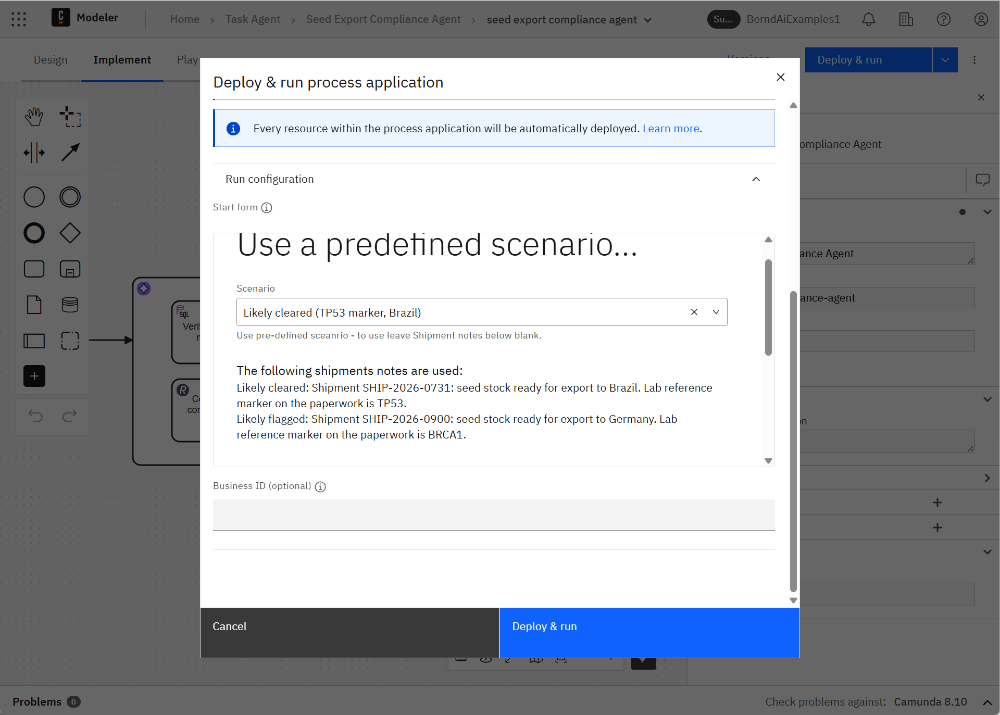
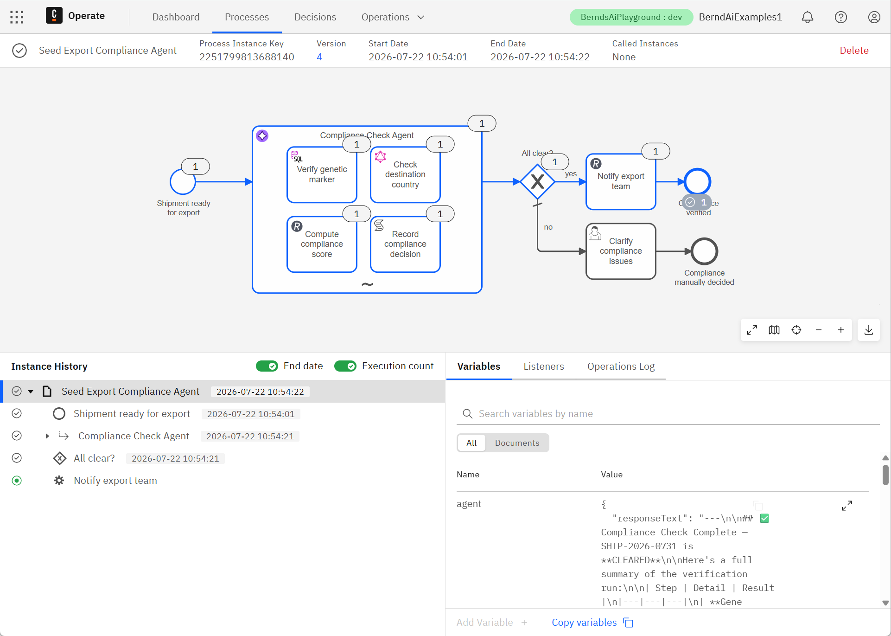
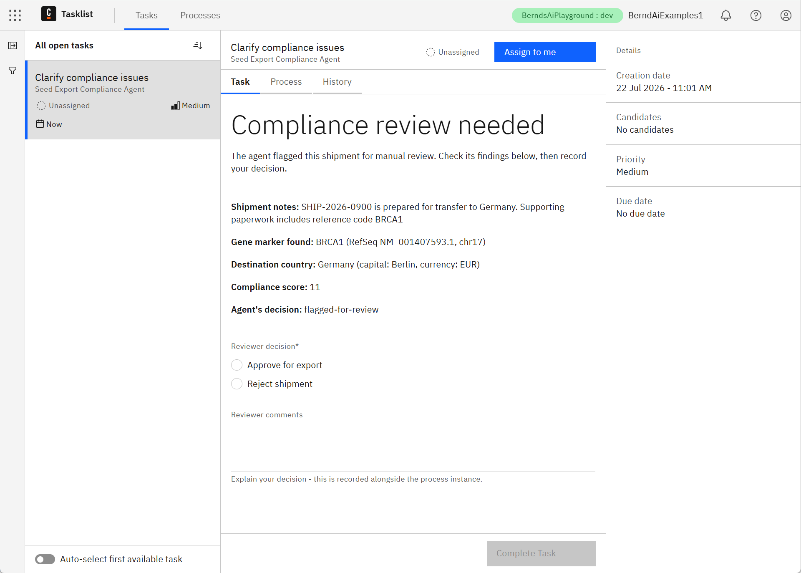

# Seed Export Compliance Agent

[](https://modeler.cloud.camunda.io/import/resources?source=https://raw.githubusercontent.com/berndruecker/camunda-examples-quick-turnaround/main/task-agent/models/seed-export-compliance-agent.bpmn,https://raw.githubusercontent.com/berndruecker/camunda-examples-quick-turnaround/main/task-agent/models/seed-export-shipment-ready.form,https://raw.githubusercontent.com/berndruecker/camunda-examples-quick-turnaround/main/task-agent/models/seed-export-compliance-review.form&title=Seed%20Export%20Compliance%20Agent)


A concrete runnable **Task Agent** example based on the pattern at [camunda.com/orchestrate/agents](https://camunda.com/orchestrate/agents/).


It contains:

- one agent subprocess with real tool calls
- unstructured text input (agent must extract marker and country)
- deterministic routing after agent finishes with human handoff for flagged cases
- visible orchestration and outcomes via Camunda tooling

It is intentionally compact so you can import, run, and inspect quickly.

The use case would in reality probably don't require agentic reasoning, but we dumbed the example down to make it simple, so bare with us here.

## Try it in 5 minutes (Camunda 8 SaaS - recommended)

The smoothest path is to use a trial cluster in Camunda SaaS. Just use the following button and install the example into your cluster - you can signup on the way if you don't yet have one:

[](https://modeler.cloud.camunda.io/import/resources?source=https://raw.githubusercontent.com/berndruecker/camunda-examples-quick-turnaround/main/task-agent/models/seed-export-compliance-agent.bpmn,https://raw.githubusercontent.com/berndruecker/camunda-examples-quick-turnaround/main/task-agent/models/seed-export-shipment-ready.form,https://raw.githubusercontent.com/berndruecker/camunda-examples-quick-turnaround/main/task-agent/models/seed-export-compliance-review.form&title=Seed%20Export%20Compliance%20Agent)

Why SaaS first:

- Preconfigured to use the [Camunda-provided LLM](https://docs.camunda.io/docs/components/agentic-orchestration/camunda-provided-llm/), so no access tokens, secrets, or external API keys needed
- No local installation required


1. Click [the button above](https://modeler.cloud.camunda.io/import/resources?source=https://raw.githubusercontent.com/berndruecker/camunda-examples-quick-turnaround/main/task-agent/models/seed-export-compliance-agent.bpmn,https://raw.githubusercontent.com/berndruecker/camunda-examples-quick-turnaround/main/task-agent/models/seed-export-shipment-ready.form,https://raw.githubusercontent.com/berndruecker/camunda-examples-quick-turnaround/main/task-agent/models/seed-export-compliance-review.form&title=Seed%20Export%20Compliance%20Agent) to import the example into Camunda SaaS.
2. Click **Deploy and Run**, the process is deployed onto your cluster and the form to start an instance is opened.
3. Pick a **Scenario** from the dropdown and leave **Shipment notes** blank to run it as-is. Or fill the **Shipment notes** yourself with data you want to try - whatever you type there takes priority over the dropdown

   (Starting via API/`zbctl` instead of the form works the same way — just supply `shipmentId` and `shipmentNotes` directly, e.g. the "cleared" sample:
   ```json
   {
      "shipmentId": "SHIP-2026-0731",
      "shipmentNotes": "Shipment SHIP-2026-0731: seed stock ready for export to Brazil. Lab reference marker on the paperwork is TP53."
   }
   ```
   )

   
4. Watch the flow in Operate: the agent produces a decision, an exclusive gateway routes deterministically, and only the "all clear" path sends the notification automatically.

   
5. You can see the human handoff in Tasklist and complete the task yourself to finish the process

   

## What happens technically

Inside the agent scope, the model invokes three tools backed by real public services.

| # | Capability | Protocol | Public service used | Tool / BPMN element |
|---|---|---|---|---|
| 1 | Query data | SQL | UCSC public MySQL server (`hg38`) | `VerifyGeneticMarker` |
| 2 | Call API | GraphQL | [Countries GraphQL API](https://countries.trevorblades.com/) | `CheckDestinationCountry` |
| 3 | Compute/update | REST | [api.mathjs.org](https://api.mathjs.org) | `ComputeComplianceScore` |

All those tools are governed by Camunda, which means every call is a first-class, versioned BPMN element: retried automatically on failure, fully visible and audited in Operate, and constrained to exactly the tools modeled in the ad-hoc sub-process — the agent can only ever call what's actually there, never something it invents.

After the agent completes, process flow is deterministic:

- `All clear?` gateway evaluates the decision
- `yes` path calls `NotifyExportTeam` (REST to [httpbin.io](https://httpbin.io))
- `no` path creates the user task `Clarify compliance issues`

The key point: input is free text, not pre-parsed fields. The agent extracts the marker and country and decides tool usage dynamically; the BPMN handles deterministic branching and human escalation.

## Demo scenarios

The start form's **Scenario** dropdown carries the sample shipment notes for
both of these directly — no need to type anything by hand, as long as
**Shipment notes** is left blank (it always overrides the dropdown when
filled in). **Shipment ID** is just informational and doesn't affect the
outcome.

### Likely cleared

Shipment notes (unstructured):

`Shipment SHIP-2026-0731: seed stock ready for export to Brazil. Lab reference marker on the paperwork is TP53.`

TP53 (4 chars) + Brasília (8 chars) = compliance score 12 (even) → `cleared`.

### Likely flagged for review

Shipment notes (unstructured):

`Shipment SHIP-2026-0900: seed stock ready for export to Germany. Lab reference marker on the paperwork is BRCA1.`

BRCA1 (5 chars) + Berlin (6 chars) = compliance score 11 (odd) →
`flagged-for-review`.

### Both scenarios, the agent:

1. Extracts marker and destination country from text
2. Converts country to ISO code
3. Calls verification and scoring tools
4. Returns a decision used by the deterministic `All clear?` gateway
5. Either notifies automatically (`yes`) or routes to human clarification (`no`)

## Local/self-managed path (advanced)

Use this only if you need local Docker-based setup with your own LLM.

1. [Install a local LLM](https://docs.camunda.io/docs/next/guides/getting-started-agentic-orchestration/#set-up-ollama) (or use hosted credentials).
2. Configure environment variables (example for local Ollama):

```env
SECRET_CAMUNDA_PROVIDED_LLM_API_ENDPOINT=http://localhost:11434/v1
SECRET_CAMUNDA_PROVIDED_LLM_API_KEY=null
SECRET_CAMUNDA_PROVIDED_LLM_DEFAULT_MODEL=gpt-oss:20b
```

3. Start [Camunda 8 Run](https://docs.camunda.io/docs/self-managed/quickstart/developer-quickstart/c8run/).
4. Deploy [models/seed-export-compliance-agent.bpmn](models/seed-export-compliance-agent.bpmn) and [models/seed-export-shipment-ready.form](models/seed-export-shipment-ready.form).
5. Start an instance via Tasklist's form (pick a scenario from the
   dropdown) or with the same sample variables shown above.

Camunda secrets read `secrets.<NAME>` from same-named environment variables.

## Optional: see live notifications

By default, `NotifyExportTeam` posts to `https://httpbin.io/post` (echo response
only). This runs on the `yes` branch after the `All clear?` gateway.

For a live demo:

1. Create a unique URL at [webhook.site](https://webhook.site/).
2. Replace the `url` input in the `NotifyExportTeam` task.
3. Start a new instance and observe incoming requests in webhook.site.

## Notes and disclaimer

This is an illustrative demo only.

- Public services are stand-ins for real enterprise systems.
- No real regulatory, health, or personal data is used.
- Nothing here should be interpreted as regulatory guidance.

Please be respectful of shared public services. This example is intentionally low-volume and not intended for load testing.
